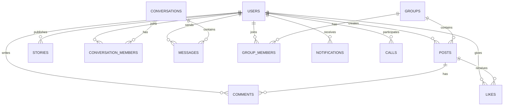

# 🏛️ Orbit System Architecture & Database Design

This document details the architectural decisions, database entity-relationship models, and real-time event lifecycle for Orbit.

---

## 📐 High-Level Architecture

Orbit is structured as a decoupled monorepo containing a React Single-Page Application (SPA) client and a Node.js/Express backend server that integrates an embedded Aedes MQTT broker and an embedded PeerJS WebRTC signaling server.

```
┌─────────────────────────────────────────────────────────────┐
│                       ORBIT FRONTEND                        │
│                                                             │
│   React 18 + Vite       Zustand Stores      MQTT.js Client  │
│   TanStack Query        Tailwind CSS        PeerJS Client   │
└─────────────┬──────────────────┬─────────────────┬──────────┘
              │                  │                 │
     HTTPS / REST API       WS (Port 8883)     WebRTC Signaling
              │                  │                 │
┌─────────────▼──────────────────▼─────────────────▼──────────┐
│                       ORBIT BACKEND                         │
│                                                             │
│  Express 4 REST Router  Embedded Aedes MQTT  PeerJS Server  │
│  JWT Authentication     Presence Tracker     STUN Proxy     │
│  Multer Disk Storage    Story Cleanup Cron   OpenGraph Scrp │
└──────────────────────────────┬──────────────────────────────┘
                               │
                               ▼
┌─────────────────────────────────────────────────────────────┐
│                    PERSISTENT STORAGE                       │
│                                                             │
│       SQLite (dev.db via Prisma ORM, 13 Relational Models)  │
│       Local Disk File System (/uploads directory)           │
└─────────────────────────────────────────────────────────────┘
```

---

## 🗄️ Relational Database Schema (Prisma / SQLite)

Orbit maintains a clean 13-table relational schema:



### Table Overview:
1. `users`: Stores credentials (bcrypt hashed), profile details, online presence flags, security questions.
2. `posts`: Chronological posts, supports text, media gallery JSON, link preview JSON, group relation, and visibility flags.
3. `comments`: Threaded comments on posts with `parent_comment_id` self-relation for 1-level nested replies.
4. `likes`: Post reactions uniquely constrained on `(post_id, user_id)`.
5. `stories`: 24-hour auto-expiring ephemeral media stories with text overlay JSON.
6. `story_views`: View receipts for stories uniquely constrained on `(story_id, viewer_id)`.
7. `conversations`: Direct or group chat threads.
8. `conversation_members`: Junction table mapping users to conversations with unread counter and muted flags.
9. `messages`: Direct or group chat messages (text, image, video, voice note, file) with reply references.
10. `groups`: Micro-groups with privacy settings (public/private) and strict 10-member limits.
11. `group_members`: Junction table mapping members to groups with roles (`admin`, `moderator`, `member`).
12. `friendships`: Bilateral friendship graph with statuses (`pending`, `accepted`, `rejected`).
13. `notifications`: Real-time notification logs for likes, comments, DMs, calls, and friend requests.
14. `calls`: WebRTC voice and video call logs with duration and status tracking.

---

## ⚡ Embedded MQTT Real-Time Mesh

Orbit replaces third-party cloud push notification servers with an embedded Aedes MQTT broker running inside the Node.js server process:
* **TCP Port 1883:** Native MQTT protocol interface.
* **WebSocket Port 8883:** WSS interface for browser clients.
* **Event Dispatching:** Server publishes state changes to specific topic channels (e.g. `orbit/chat/{convId}`, `orbit/user/{userId}/notifications`).
* **Presence Tracking:** When a WebSocket client connects or disconnects, Aedes hooks automatically update the SQLite `is_online` status and broadcast the change to `orbit/user/{userId}/status`.

---

## 📞 WebRTC Audio & Video Calling Architecture

Voice and video calling is implemented using PeerJS with full peer-to-peer data transport:
1. **Signaling Server:** Embedded inside the Express HTTP server on route `/peerjs`.
2. **STUN Configuration:** Uses Google STUN servers (`stun:stun.l.google.com:19302`) for NAT traversal.
3. **Call Lifecycle:**
   * Caller initiates call -> sends MQTT notification to `orbit/user/{targetId}/call`.
   * Callee displays incoming call modal with audio ringing tone.
   * On accept, PeerJS establishes a direct peer-to-peer WebRTC audio/video stream.
   * Active call controls provide live mute, camera toggle, speaker toggle, and duration timers.
   * Call summary records are saved to the SQLite `calls` table upon termination.
